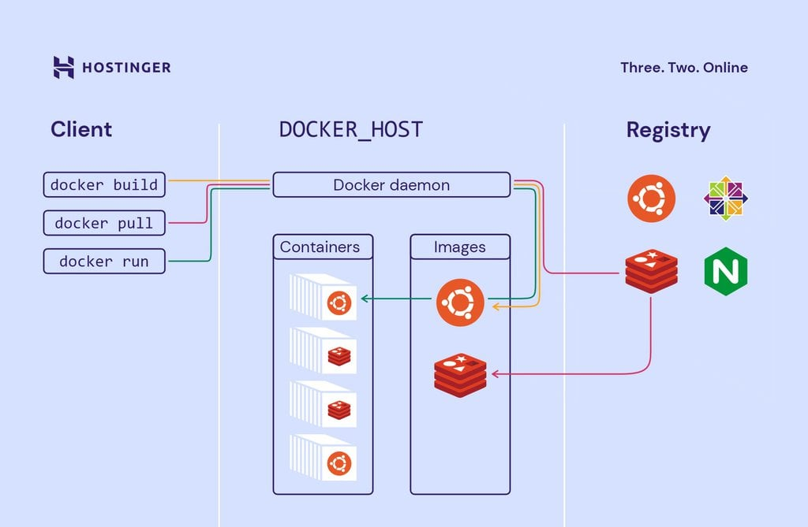
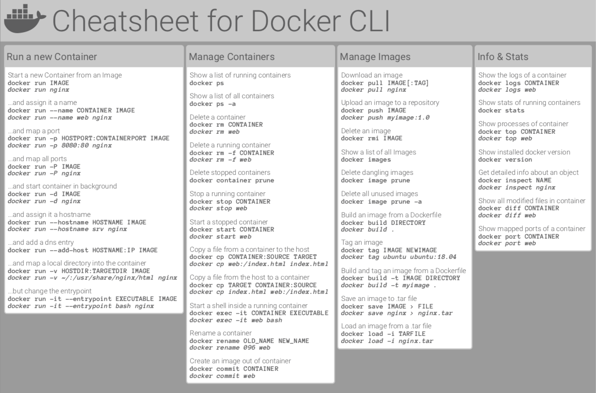
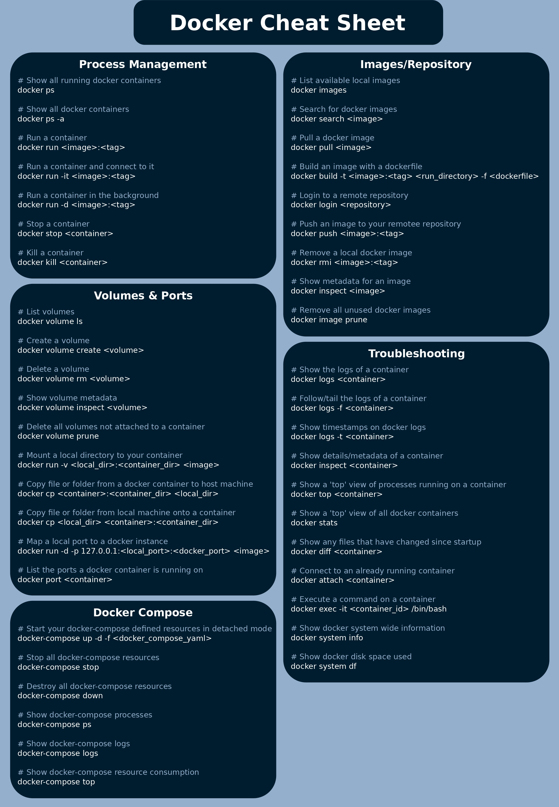

# 1 - Docker

# 2 - Comandos Docker

# 3 - Comandos para criar bind mount, persintindo pasta local no container
docker run -d --name nginx -p (porta host):(porta container) -v (pasta host local):(local no container) nginx

# 3.1 - Subindo nginx com site da pasta template,usando comando antigo
docker run -d --name nginx -p 8080:80 -v $(pwd)/template:/usr/share/nginx/html nginx

# 3.2 - Subindo nginx com site da pasta template,usando comando mas recente
docker run -d --name web -p 8080:80 --mount type=bind,source="$(pwd)"/template,target=/usr/share/nginx/html nginx

# 4 - Volumes no Docker - criando volume
docker create volume meuvolume

# 5 - Usando volume criado como persistencia
docker run -d --name web -p 8080:80 --mount type=volume,source=meuvolume,target=/app nginx

# 6 - Criando uma imagem personalizada aparti do Dockerfile
docker build -t purpleteamvtx/nginx-nano:latest .

# 6.1 - Criando com imagem com dockerfile em outra pasta 
docker build -t purpleteamvtx/site:latest -f site/Dockerfile .

# 7 - Subindo imagem para docker hub
docker push purpleteamvtx/nginx-nano:latest

# 8 - Criando Rede (network)
docker network create --driver bridge minharede

# 9 - Acessando host local atraves do container
curl http://host.docker.internal:8000

